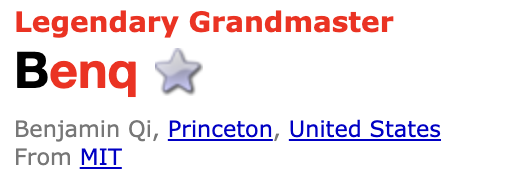
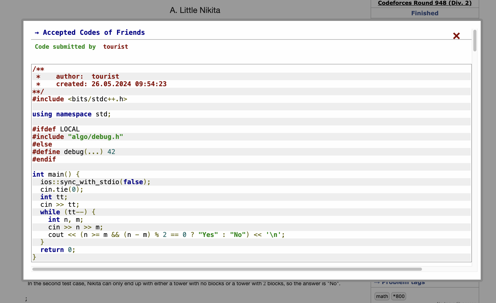
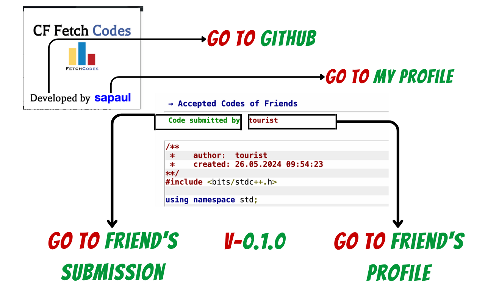

# CF FetchCodes Documentation

## Introduction
CF FetchCodes is a powerful browser extension designed to enhance the CodeForces experience for developers and coding enthusiasts. With CF FetchCodes, you can effortlessly fetch and explore the accepted codes of your CodeForces friends, gaining valuable insights, and expanding your coding horizons.

## Installation
To install CF FetchCodes, follow these steps:
1. Visit the [Firefox Add-ons Store](https://addons.mozilla.org/en-US/firefox/addon/cf-fetchcodes/).
2. Click on the "Add to Firefox" button.
3. A confirmation dialog will appear. Click "Add" to install CF FetchCodes.
4. Once installed, CF FetchCodes will be added to your browser's toolbar.

## Usage
CF FetchCodes adds an extra content section named "Accepted Codes of Friends" on the sidebar of CodeForces problem pages. It contains a "Show Code" button. Clicking on the button opens a pop-up window on the same page, displaying the accepted codes of your CodeForces friends.

To use CF FetchCodes:
1. Visit a problem page on CodeForces.
2. Locate the "Accepted Codes of Friends" section on the sidebar.
3. Click on the "Show Code" button.
4. A pop-up window will appear, showing the accepted codes of your friends who have solved the same problem.
5. Explore the codes, learn from different approaches, and gain valuable insights.

📺 [YouTube Guide: CF FetchCodes](https://www.youtube.com/watch?v=gcQwU1W23x8)

**Note:** This feature assumes that you have friends on your CodeForces account. 

#### How to Add Friends on CodeForces:
1. Log in to your CodeForces account.
2. Go to the profile page of the user you want to add as a friend.
3. Click the "Star" ⭐️ button next to handle on their profile page.

Once you have added friends, CF FetchCodes will be able to display their accepted codes on problem pages.

## Privacy and Security
CF FetchCodes prioritizes your privacy and security. The extension operates entirely within your browser and only interacts with CodeForces. Your personal data remains secure, and no sensitive information is stored or shared.

## Feedback and Contributions
We welcome your feedback and contributions to improve CF FetchCodes. If you encounter any issues or have suggestions for enhancements, please visit our [GitHub repository](https://github.com/sa-paul/CF_FetchCodes). You can submit bug reports, feature requests, or even contribute code through pull requests.

## Support and Contact
If you need any assistance or have any questions regarding CF FetchCodes, feel free to reach out to our support team. You can contact us by sending an email to [sayanpauldeveloper@gmail.com](mailto:sayanpauldeveloper@gmail.com).

## New Features
- **Added Code Highlighter:** Implemented syntax highlighting similar to the default highlighter on CodeForces, enhancing code readability and user convenience.

- **Clickable Button:** Added a button to easily navigate to a friend's profile and submission, making it simpler to explore and learn from their accepted codes.

### Performance Improvements
- **Enhanced Speed:** Improved performance for faster code fetching, with a rate limit of 5 fetches every 6.5 seconds, ensuring a smoother and more efficient user experience.

### Bug Fixes
- **Repetitive Code Occurrences:** Fixed issues with repetitive code occurrences, providing a more reliable fetching process.
- **Code Not Found Errors:** Addressed errors related to code not being found, ensuring you can access the accepted codes without interruptions.

## Conclusion
CF FetchCodes is your go-to companion for exploring the accepted codes of your CodeForces friends. Gain insights, learn new techniques, and expand your coding knowledge. Install CF FetchCodes today and unlock a world of coding possibilities on CodeForces.

Happy coding with CF FetchCodes!